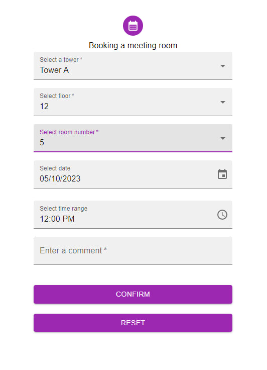

---

This is a booking form

The form features include:

- dropdown lists, date and time entry, selection windows
- form field validation on blur ( using yup )
- form field masking / normalisation
- using react-hook-form with material-ui

## Contributors ✨

<table>
  <tr>
    <td align ="center"> <b>Elizaveta Kozhemyakina</b></a> <a href="https://github.com/KozhemyakinaElizaveta/React_form.git" title="Code">💻</a></td>
  </tr>
</table>